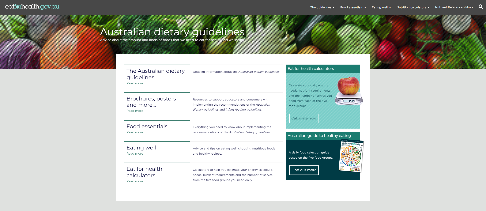
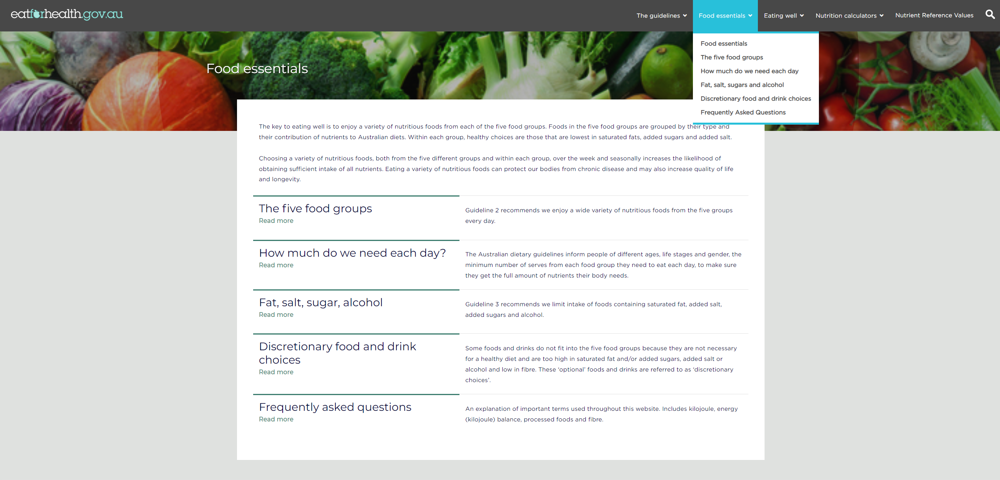
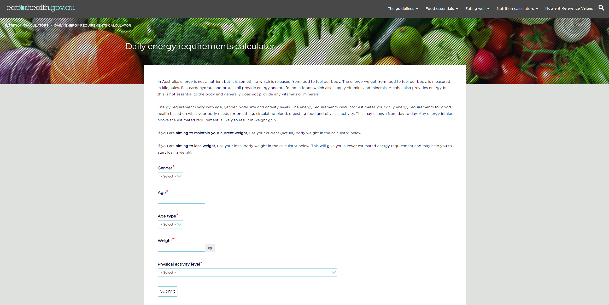

# Требования к проекту

---

## Содержание

[1 Введение](#1-введение)  
[1.1 Назначение](#11-назначение)  
[1.2 Бизнес-требования](#12-бизнес-требования)  
[1.2.1 Исходные данные](#121-исходные-данные)  
[1.2.2 Возможности бизнеса](#122-возможности-бизнеса)  
[1.2.3 Границы проекта](#123-границы-проекта)  
[1.3 Аналоги](#13-аналоги)  
[2 Требования пользователя](#2-требования-пользователя)  
[2.1 Интерфейс пользователя](#21-интерфейс-пользователя)  
[2.2 Характеристики пользователей](#22-характеристики-пользователей)  
[2.2.1 Классы пользователей](#221-классы-пользователей)  
[2.2.2 Аудитория приложения](#222-аудитория-приложения)  
[2.2.2.1 Целевая аудитория](#2221-целевая-аудитория)  
[2.2.2.2 Побочная аудитория](#2222-побочная-аудитория)  
[2.3 Предположения и зависимости](#23-предположения-и-зависимости)  
[3 Системные требования](#3-системные-требования)  
[3.1 Функциональные требования](#31-функциональные-требования)  
[3.1.1 Основные функции](#311-основные-функции)  
[3.1.1.1 Вход и выход пользователя в учетную запись](#3111-вход-и-выход-пользователя-в-учетную-запись)  
[3.1.1.2 Наличие уведомлений](#3112-наличие-уведомлений)  
[3.1.1.3 Удобный поиск](#3113-удобный-поиск)  
[3.1.1.4 Система заказов](#3114-система-заказов)  
[3.1.1.5 Наличие отзывов](#3115-наличие-отзывов)   
[3.1.2 Ограничения и исключения](#312-ограничения-и-исключения)  
[3.2 Нефункциональные требования](#32-нефункциональные-требования)  
[3.2.1 Атрибуты качества](#321-атрибуты-качества)  
[3.2.1.1 Требования к удобству использования](#3211-требования-к-удобству-использования)  
[3.2.1.2 Требования к безопасности](#3212-требования-к-безопасности)  
[3.2.2 Внешние интерфейсы](#322-внешние-интерфейсы)  

# 1 Введение

## 1.1 Назначение

В этом документе будут описаны функциональные и нефункциональные требования к
сайту "eatforhealth". Данный документ предназначен для
команды, которая будет реализовывать и заниматься отладкой работы онлайн-каталога.

## 1.2 Бизнес-требования

### 1.2.1 Исходные данные
Н а сегодняшний день очень актуальна тема линего веса по всему миру. Мниз людей затрагивает данная тема, и равно или поздно каждый из них обращается к различным
сервисам, предоставляющим информацию о правильном питании, и, в принципе, что делать "пострадавшему".
Соответственно появляется спрос. А где спрос - там и возможности!
Данный сервис представляет собой сборник всей той информации, в которой нуждается множество людей, в котором каждый сможет найти решение своей проблемы.
### 1.2.2 Возможности бизнеса
Данный сайт делает выбор быстрым и удобным для пользователей благодаря удобным фильтрам и большому количеству предложений, а также является универсальной площадкой
для магазинов продуктов и продуктов спортивного питания, в том числе у которых отсутствует собственный сайт. В синнергии с ними в перспективе можно организоваь не только правильное питание на день, но и прямую доставку потребителю.

### 1.2.3 Границы проекта

Сайт предоставляет большие порции информации, которая направлена на закрытие каждого вопроса нуждающегося.
Пользователь может оставлять отзывы на предоставляюемую нами информацию.

## 1.3 Аналоги
Diet&Diary - сайт-дневник, который даёт возможность не только рассчитать по различным параметрам нужные каллории, но и также вести дневник, благодаря которому потребитель имеет возможность удобно "документировать" свои приёмы пищи и достижения.

Myherbals - сайт - аналог выше описанного, в котором также есть онлайн-магазин, где клиент может приобрести всё необходимое из списка, который ему порекомендовали в связи с индивидуальной ситуацией.
# 2 Требования пользователя

## 2.1 Интерфейс пользователя

Главная страница сайта.

Страница каталога выбранной категории.

Страница калькулятора.

## 2.2 Характеристики пользователей

### 2.2.1 Классы пользователей

| Класс пользователей             | Описание                                                                                                                        |
|:--------------------------------|:--------------------------------------------------------------------------------------------------------------------------------|
| Анонимные пользователи          | Пользователи, которые не хотят регистрироваться в приложении. Имеют доступ к частичному функционалу.                            |
| Зарегистрированные пользователи | Пользователи, которые вошли в приложение под своим именем. Имеют доступ к полному функционалу. Могут добавлять товары в избранное и заказывать их напрямую из каталога |
| Магазины-пользователи           | Пользователи, обладающие возможностью добавлять товары в каталог и получать заказы.                                             |

### 2.2.2 Аудитория приложения

#### 2.2.2.1 Целевая аудитория

Люди любой возрастной категории, имеющие проблемы со здоровьем и весом, нуждающиеся в консультации и помощи с планом-решением проблемы. 

#### 2.2.2.2 Побочная аудитория
Люди любой возрастной категории, оценивающие рынок правильного питания, рейтинг магазинов, брендов и производителей(спорт.пит.).

## 2.3 Предположения и зависимости

1. Сайт не работает без интернет соединения.
2. Необходимо привлекать большое количество продавцов с целью увеличения количества товаров и предложений.

# 3 Системные требования

## 3.1 Функциональные требования

### 3.1.1 Основные функции

#### 3.1.1.1 Вход и выход пользователя в учетную запись
Каталог позволяет пользователю пользоваться частичным функционалом без регистрации, создать учетную запись для получения полного функционала, выйти из существующей учетной записи. Создание коммерческого аккаунта продавца происходит с индивидуальным договором.
#### 3.1.1.2 Наличие уведомлений
Используются уведомления при смене цены на товар, изменении статуса заказа, особых акциях и новинках, а также уведомления о новых статьях или заказов для продавцов.
#### 3.1.1.3 Удобный поиск
Сайт использует большое количество фильтров и категорий благодаря которым поиск происходит быстро и удобно. Существует возможность добавить понравившийся товар в избранное, а также оставить заметку в статье.
#### 3.1.1.4 Система заказов
Пока что отсутствует.
#### 3.1.1.5 Наличие отзывов
Пользователь может оставить отзыв на сервис, что позволит составить рейтинг для улучшения качества работы и поступающей информации.
### 3.1.2 Ограничения и исключения

1. Приложение функционирует в полном наборе возможностей только при наличии
   подключения к Интернету;
## 3.2 Нефункциональные требования

### 3.2.1 Атрибуты качества

#### 3.2.1.1 Требования к удобству использования

1. Простой и удобный интерфейс с большим количеством категорий и фильтров, которые не должны перегружать его

#### 3.2.1.2 Требования к безопасности

1. Приложение предоставляет возможность просмотра и редактирования
профиля только зарегистрированного пользователя.
2. Необходима верификация при создании аккаунта магазина.

### 3.2.2 Внешние интерфейсы

Элементы интерфейса распределены равномерно по всему экрану, акценировано внимание на переменные, в которым клиент может проявить повышенное внимание.

